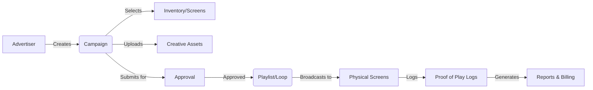
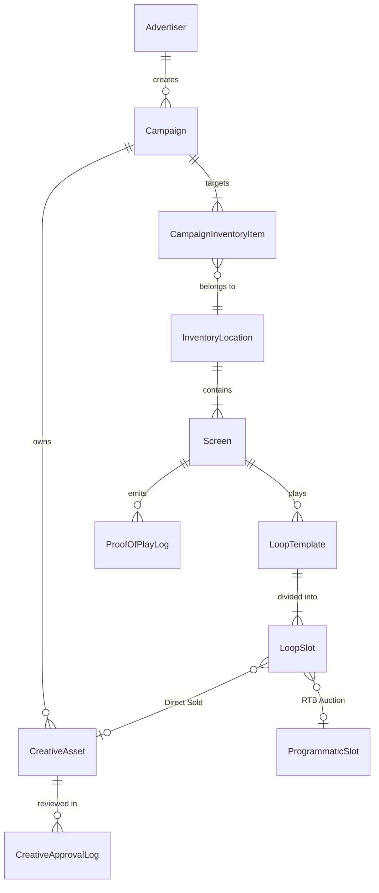

# DOOH Platform - Architecture & Domain Guide

This document provides a high-level overview of the Digital Out-Of-Home (DOOH) platform. It is designed to help human developers (and AI agents) quickly understand the core business logic, entity relationships, and technical stack.

## 1. High-Level Flow (Advertiser to Screen)

The DOOH platform bridges the gap between Advertisers wanting to buy ad space and Screens playing the content.



## 2. Core Entity Relationship (ER) Model

This is a simplified view of the database schema defined in `docs/backend/step14-schema-design.md`.



## 3. Playback Modes: Direct vs. Programmatic

The system supports a hybrid playback model for every screen loop (e.g., a 5-minute cycle divided into 10-second slots).

1.  **Direct-Sold (CMS 直播)**: Guaranteed placements. Advertisers buy specific screens for specific dates. The slot is statically assigned to a `CreativeAsset`.
2.  **Programmatic (RTB 競標)**: Remnant or premium real-time inventory. When the screen hits a `ProgrammaticSlot`, the SSP sends an Ad Request. DSPs bid within 300ms. The winner's creative plays. If no bids, a Fallback creative plays.

## 4. Directory Structure Map

```text
/
├── .agent/            # Superpowers Agent skills framework
├── docs/              # Deep-dive specs (PRDs, DB Schema, APIs)
│   ├── backend/       # 👉 READ step14-schema-design.md BEFORE touching DB
│   └── superpowers/   # Agent framework docs
├── public/            # Static assets and mock images
└── src/
    ├── app/           # Next.js App Router entry points
    ├── components/    # React Components
    │   ├── admin/     # CMS & Approval workflows
    │   ├── planner/   # Advertiser Campaign Planner (MVP)
    │   ├── player/    # Web Player Simulator
    │   └── reports/   # Analytics & Proof of Play
    ├── data/          # Mock JSON data (used in MVP)
    ├── i18n/          # Lightweight multi-language context
    ├── store/         # Zustand or Context states
    ├── types/         # TypeScript interfaces
    └── utils/         # Helpers (Formatters, PoP calculators)
```

## 5. Technical Decisions (ADR)

*   **MVP Scope (Current)**: The app runs purely on the client-side using `mockData` to validate the UI/UX flows (Planner, Review, Mock Player).
*   **Database (Future)**: The application is designed to integrate with **Supabase (PostgreSQL)**. Strict schema designs are already formalized in `docs/backend/`.
*   **Maps**: Using `react-leaflet` to avoid early dependencies on Google Maps APIs.
*   **Static Export**: The app is configured for `output: "export"` to deploy on GitHub Pages seamlessly. Server-side rendering (SSR) is intentionally bypassed for the MVP.
